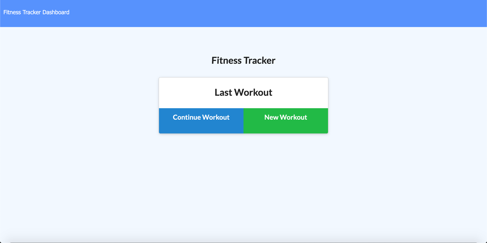

      

# Welcome to my Workout Tracker 👋

## Description

📚 This `Workout Tracker` has been developed with a `Mongo database`, a `Mongoose schema` and routes are handled with `Express`.

## Table of Contents 🗂

* [Description](#Description)
* [Installation](#Installation)
* [Usage](#Usage)
* [License](#License)
* [Version](#Version)
* [Contributing](#Contributing)
* [Tests](#Tests)
* [Questions](#Questions)

## Installation

⚙️ n/a

## Usage

🚨 View my workout tracker <a href="https://lit-beyond-88227.herokuapp.com">here</a>

## License

🖋 

This app is  using an MIT license

## Version

℣ 

## Contributing

👩‍💻 n/a

## Tests

🧪 n/a

## Questions

🌍 https://github.com/darren-behan

📧 me at darrenbehan@hotmail.com

